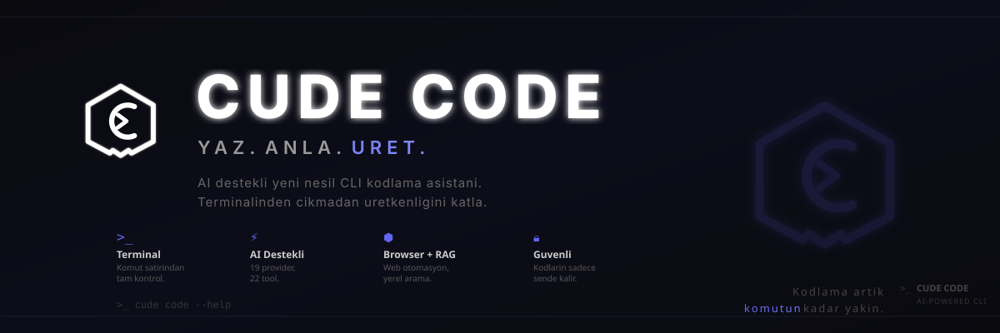
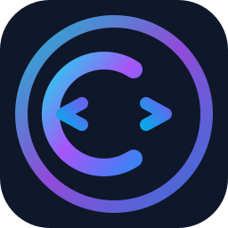
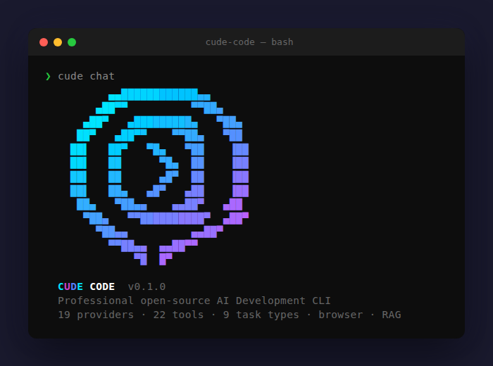

<p align="center">
  
</p>

<p align="center">
  <a href="https://github.com/Emrevrg/Cude-Code">
    
  </a>
</p>

<p align="center">
  
</p>

# Cude Code - Professional AI Development CLI

[](https://opensource.org/licenses/MIT)
[](https://nodejs.org/)
[](https://www.typescriptlang.org/)
[](https://www.npmjs.com/package/cude-code)
[](./PROJECT_STATUS.md)

**The professional, multi-provider AI development CLI for your terminal**

Cude Code is a production-ready, feature-rich CLI tool for AI-assisted development. It supports 19 AI providers, 22 agent tools, browser automation, native RAG, and brings professional capabilities to your terminal.

```bash
npm install -g cude-code
cude chat
```

## Why Cude Code?

- **Free & Open Source**: MIT licensed, no hidden costs
- **19 AI Providers**: OpenAI, Anthropic, Gemini, DeepSeek, Groq, Ollama, and more
- **22 Agent Tools**: File ops, git, npm, diff, patch, search, browser, RAG
- **Browser Automation**: Navigate, screenshot, and extract web content via Playwright
- **Native RAG**: Index local codebases and search with keyword matching
- **Autonomous Agent**: Solve complex tasks with tool-use
- **Cost Tracking**: Monitor spending, set budgets, get alerts
- **Session Management**: Save and restore conversations
- **Privacy First**: Everything stays on your machine
- **Pure CLI**: No Electron, lightweight and fast

## Quick Start

### 1. Install
```bash
npm install -g cude-code
```

### 2. Setup
```bash
cude setup
```

### 3. Start Coding
```bash
# Free chat with no API costs
cude chat --free

# Chat with GPT-4
cude chat -p openai -m gpt-4

# Run an autonomous task
cude run "Create a REST API in TypeScript"
```

## Usage Examples

### Interactive Chat
```bash
# Start a conversation
cude chat

# Use specific provider and model
cude chat -p anthropic -m claude-3-opus

# Continue a previous session
cude chat -s my-project

# Use only free providers
cude chat --free
```

### Autonomous Tasks
```bash
# Code generation
cude run "Write a React component for data table"

# Code review
cude run "Review src/api and suggest improvements"

# Bug fixing
cude run "Fix the error in main.ts"

# Documentation
cude run "Generate API docs for src/"
```

### Configuration
```bash
# Interactive setup
cude setup

# Set API keys
cude config set-key openai sk-...
cude config set-key anthropic sk-ant-...

# List configured keys
cude config list-keys

# Set defaults
cude config set default-provider openai
cude config set default-model gpt-4
```

### Provider Management
```bash
# List all providers
cude providers list

# Test connectivity
cude providers test

# View available models
cude providers models openai
```

### Budget Management
```bash
# Set spending limit
cude budget set 10          # $10 total
cude budget set 5 --monthly # $5/month

# Check spending
cude budget status

# Set alert
cude budget alert 5
```

### Session Management
```bash
# List sessions
cude sessions list

# Export session to markdown
cude sessions export <id> conversation.md

# Delete session
cude sessions delete <id>
```

## Supported Providers

### Free & Fast
- **Groq**: Free tier, fastest responses
- **Gemini Flash**: Free tier, best quality for free
- **Ollama**: Local only, completely free

### Production Quality
- **OpenAI**: GPT-4 family, most capable
- **Anthropic**: Claude 3 family, best reasoning
- **Google Gemini**: Latest models, large context
- **DeepSeek**: Affordable, excellent for code

### Self-Hosted
- **Ollama**: Local models, no setup needed
- **vLLM**: High-performance serving
- **llama.cpp**: Minimal requirements

### Complete List
OpenAI, Anthropic, Google Gemini, Groq, DeepSeek, Mistral, xAI, Cohere, Together AI, Perplexity, NVIDIA, OpenRouter, Azure OpenAI, LiteLLM, HuggingFace, vLLM, Replicate, Local GGUF, Ollama

## Available Tools

Cude Code's agent can use **22 built-in tools**:

### File Operations
`read_file`, `write_file`, `replace_in_file` (multi-occurrence via `replace_all`), `delete_file`, `copy_file`, `move_file` (rename), `get_file_info`

### Directory Management
`create_directory`, `list_directory`

### Search
`search_files` (pattern), `grep_search` (content)

### Shell & Build
`run_command`, `npm_command`, `git_command`

### Patch & Diff
`apply_patch` (multi-hunk unified diff), `diff_files` (file comparison)

### Browser Automation
`browser_navigate` (fetch page content), `browser_screenshot` (capture pages), `browser_extract` (CSS selector extraction)

### Native RAG
`rag_index` (index local files), `rag_search` (keyword search across indexed files), `rag_summary` (index overview)

Destructive commands (e.g. `rm -rf`, `mkfs.`, `shutdown`) trigger an interactive confirmation before execution.

## Cost Tracking

Built-in budget management:

```bash
# Set $10 spending limit
cude budget set 10

# Get real-time spending report
cude budget status

# Set $5 per-month limit
cude budget set 5 --monthly

# Get alerts at $8
cude budget alert 8
```

Supported cost tracking for:
- OpenAI, Anthropic, Google, Groq, and all cloud providers
- Per-token pricing for accuracy
- Historical tracking and reports

## Documentation

- **[Changelog](./CHANGELOG.md)** - Release notes

## Configuration

### Environment Variables
```bash
export CUDE_OPENAI_KEY="sk-..."
export CUDE_ANTHROPIC_KEY="sk-ant-..."
export CUDE_DEFAULT_PROVIDER="openai"
export CUDE_DEFAULT_MODEL="gpt-4"
```

> Note: API keys are normally stored in `~/.cude/config.json` via `cude config set-key`. The environment variables above are read at startup as a fallback when no stored key exists, which is handy for CI runs and ephemeral shells.

### Config Files
- **Linux/macOS**: `~/.cude/config.json`
- **Windows**: `%USERPROFILE%\.cude\config.json`

Sessions are stored under `~/.cude/sessions/` and spending records under `~/.cude/budget.json`.

## Security

- All data stored locally
- No cloud sync (unless enabled)
- API keys never logged
- Destructive commands require confirmation
- Safe command execution
- Open source for transparency

## Benchmarks

| Metric | Value |
|--------|-------|
| Startup Time | < 100ms |
| Token Estimation | Instant |
| Max File Size | 100MB |
| Memory Base | < 50MB |
| Max Contexts | Unlimited |

## Contributing

We welcome contributions! Areas we need help with:

- [ ] Additional providers
- [ ] WebUI frontend
- [ ] VS Code extension
- [ ] Documentation improvements
- [ ] Bug fixes and optimizations

## License

MIT &copy; 2025 Cude Code Contributors

Free for personal and commercial use.

## Support

- **Issues**: [GitHub Issues](https://github.com/Emrevrg/Cude-Code/issues)
- **Discussions**: [GitHub Discussions](https://github.com/Emrevrg/Cude-Code/discussions)
- **Email**: zgremre@gmail.com
- **In-app help**: run `cude --help` or `cude <command> --help`

## Roadmap

### Current (v0.1)
- 19 AI providers
- Chat & autonomous agent modes
- 22 agent tools (file ops, git, npm, diff, patch, search, browser, RAG)
- Browser automation via Playwright
- Native RAG with local file indexing
- Session management
- Cost tracking with budgets & alerts
- Environment-variable key fallback
- Automatic legacy data migration

### Planned (v0.2)
- MCP (Model Context Protocol) server support
- VS Code extension
- Advanced analytics & spend reports

### Future (v1.0)
- Web UI dashboard
- Plugin system
- Team collaboration features

---

**Made with care by developers, for developers**

*Cude Code - Where AI meets your terminal*

[](https://github.com/Emrevrg/Cude-Code)
