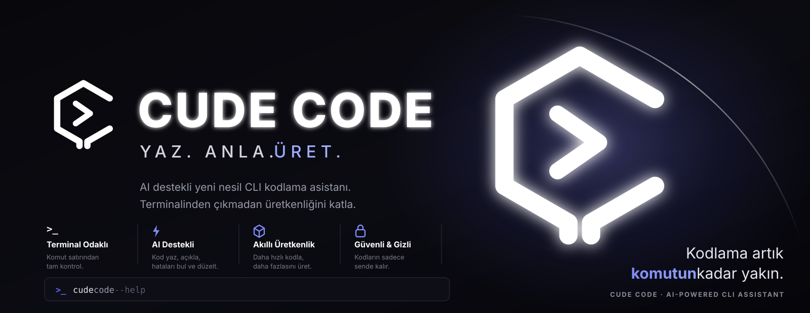
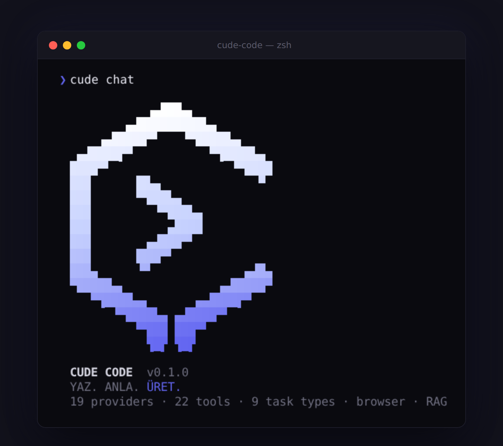

<p align="center">
  
</p>

<p align="center">
  
</p>

# Cude Code - Professional AI Development CLI

[](https://opensource.org/licenses/MIT)
[](https://nodejs.org/)
[](https://www.typescriptlang.org/)
[](./CHANGELOG.md)

**The professional, multi-provider AI development CLI for your terminal**

Cude Code is a feature-rich CLI tool for AI-assisted development. It supports 19 AI providers, 22 agent tools, browser automation, native RAG, and brings professional capabilities to your terminal.

```bash
git clone https://github.com/Emrevrg/Cude-Code.git
cd Cude-Code && npm install && npm run build && npm link
cude chat
```

## Why Cude Code?

- **Free & Open Source**: MIT licensed, no hidden costs
- **19 AI Providers**: OpenAI, Anthropic, Gemini, DeepSeek, Groq, Ollama, and more
- **22 Agent Tools**: File ops, git, npm, diff, patch, search, browser, RAG
- **Browser Automation**: Navigate, screenshot, and extract web content via Playwright
- **Native RAG**: Index local codebases and search with keyword matching
- **Autonomous Agent**: Solve complex tasks with tool-use
- **Cost Tracking**: Monitor spending, set budgets, get alerts
- **Session Management**: Save and restore conversations
- **Privacy First**: Everything stays on your machine
- **Pure CLI**: No Electron, lightweight and fast

## Quick Start

### 1. Install

Not on npm yet. Install from source — this builds the CLI and puts `cude` on
your PATH:

```bash
git clone https://github.com/Emrevrg/Cude-Code.git
cd Cude-Code
npm install
npm run build
npm link
```

Optional — only needed for the three browser tools:
```bash
npx playwright install chromium
```

### 2. Setup
```bash
cude setup
```

### 3. Start Coding
```bash
# Free chat with no API costs
cude chat --free

# Chat with GPT-4
cude chat -p openai -m gpt-4

# Run an autonomous task
cude run "Create a REST API in TypeScript"

# Or work with it interactively, approving each edit
cude claw
```

## Usage Examples

### Interactive Chat
```bash
# Start a conversation
cude chat

# Use specific provider and model
cude chat -p anthropic -m claude-opus-5

# Continue a previous session
cude chat -s my-project

# Use only free providers
cude chat --free
```

### Cude Claw — interactive sessions

Claw keeps context between turns and shows you every edit before it happens.

```bash
cude claw                          # start a session
cude claw "refactor src/api"       # start with a task
cude claw --mode ask               # read-only: it cannot modify anything
cude claw -y                       # apply edits without asking
```

Inside a session:

| | |
|---|---|
| `@src/app.ts` | Attach a file's contents to your message |
| `/mode architect` | Switch mode mid-conversation |
| `/model claude-sonnet-5` | Switch model |
| `/cost` | Spend so far this session |
| `/undo` | Revert every file change this session made |
| `/tools` `/mcp` `/rules` | What the agent currently has available |
| `/help` | Everything else |

When the agent wants to change a file, you see the diff and choose
`y` / `n` / `a`(lways) / `s`(top).

### Agent Modes

A mode is a system prompt plus a **tool budget** — what the agent may touch, not
just what it is told to do. The restriction is enforced when the tool list is
built *and* again before each call.

| Mode | Can do |
|---|---|
| `code` | Everything (default) |
| `architect` | Reads anything, writes only Markdown |
| `ask` | Read-only — cannot modify anything |
| `debug` | Everything, prompted to find causes before fixes |
| `orchestrator` | Everything, works through ordered sub-tasks |

```bash
cude run "plan the migration" --mode architect
cude modes list
cude modes show ask
```

### Project Rules

Standing instructions live in the repository, not in every prompt. Cude reads
`AGENTS.md`, `CUDE.md`, `.cuderules` and `.cude/rules/*.md`, walking from the
filesystem root down to your workspace — so a monorepo-wide rule applies to the
packages inside it, and the closest file wins.

```bash
cude rules    # show which files are in effect
```

### Undo

Every agent file change is checkpointed first, so a wrong edit is not permanent.
Works without git, and never touches git if present — an agent run is not a
commit.

```bash
cude checkpoint list
cude checkpoint restore-run <id>   # undo a whole run
cude checkpoint restore <id>       # undo one tool call
```

### MCP Servers

Connect Model Context Protocol servers to give the agent tools beyond the
built-in ones. `~/.cude/mcp.json` uses the same `mcpServers` shape as other MCP
clients, so an existing configuration copies across unchanged.

```bash
cude mcp add files --command npx -- -y @modelcontextprotocol/server-filesystem .
cude mcp add docs --url https://example.com/mcp
cude mcp test        # connect to each and list its tools
cude mcp disable docs
```

Servers are verified before they are saved, tools are namespaced
`mcp__<server>__<tool>` so none can shadow a built-in, and a server that fails
to start is reported and skipped rather than taking the run down.

### Autonomous Tasks
```bash
# Code generation
cude run "Write a React component for data table"

# Code review
cude run "Review src/api and suggest improvements"

# Bug fixing
cude run "Fix the error in main.ts"

# Documentation
cude run "Generate API docs for src/"
```

### Configuration
```bash
# Interactive setup
cude setup

# Set API keys
cude config set-key openai sk-...
cude config set-key anthropic sk-ant-...

# List configured keys
cude config list-keys

# Set defaults
cude config set default-provider openai
cude config set default-model gpt-4o
```

### Provider Management
```bash
# List all providers
cude providers list

# Test connectivity
cude providers test

# View available models
cude providers models openai
```

### Budget Management
```bash
# Set spending limit
cude budget set 10          # $10 total
cude budget set 5 --monthly # $5/month

# Check spending
cude budget status

# Set alert
cude budget alert 5

# Remove a limit (reset only clears the counters)
cude budget unset --total
cude budget unset --all
```

Free and local providers (Ollama, vLLM, llama.cpp) are never blocked by a
spending limit — they do not cost anything to block.

### Session Management
```bash
# List sessions
cude sessions list

# Export session to markdown
cude sessions export <id> conversation.md

# Delete session
cude sessions delete <id>
```

## Supported Providers

### Free & Fast
- **Groq**: Free tier, fastest responses
- **Gemini Flash**: Free tier, best quality for free
- **Ollama**: Local only, completely free

### Production Quality
- **OpenAI**: GPT-4 family, most capable
- **Anthropic**: Claude 5 family (Opus 5, Sonnet 5), best reasoning
- **Google Gemini**: Latest models, large context
- **DeepSeek**: Affordable, excellent for code

### Self-Hosted
- **Ollama**: Local models, no setup needed
- **vLLM**: High-performance serving
- **llama.cpp**: Minimal requirements

### Complete List
OpenAI, Anthropic, Google Gemini, Groq, DeepSeek, Mistral, xAI, Cohere, Together AI, Perplexity, NVIDIA, OpenRouter, Azure OpenAI, LiteLLM, HuggingFace, vLLM, Replicate, Local GGUF, Ollama

## Available Tools

Cude Code's agent can use **22 built-in tools**:

### File Operations
`read_file`, `write_file`, `replace_in_file` (multi-occurrence via `replace_all`), `delete_file`, `copy_file`, `move_file` (rename), `get_file_info`

### Directory Management
`create_directory`, `list_directory`

### Search
`search_files` (pattern), `grep_search` (content)

### Shell & Build
`run_command`, `npm_command`, `git_command`

### Patch & Diff
`apply_patch` (multi-hunk unified diff), `diff_files` (file comparison)

### Browser Automation
`browser_navigate` (fetch page content), `browser_screenshot` (capture pages), `browser_extract` (CSS selector extraction)

### Native RAG
`rag_index` (index local files), `rag_search` (keyword search across indexed files), `rag_summary` (index overview)

Destructive commands (e.g. `rm -rf`, `mkfs.`, `shutdown`) trigger an interactive confirmation before execution.

## Cost Tracking

Built-in budget management:

```bash
# Set $10 spending limit
cude budget set 10

# Get real-time spending report
cude budget status

# Set $5 per-month limit
cude budget set 5 --monthly

# Get alerts at $8
cude budget alert 8
```

Supported cost tracking for:
- OpenAI, Anthropic, Google, Groq, and all cloud providers
- Per-token pricing for accuracy
- Historical tracking and reports

## Documentation

- **[Changelog](./CHANGELOG.md)** - Release notes
- **[Contributing](./CONTRIBUTING.md)** - Development setup and project layout
- **[Security](./SECURITY.md)** - Reporting vulnerabilities, and what the agent can reach

## Configuration

### Environment Variables
```bash
export CUDE_OPENAI_KEY="sk-..."
export CUDE_ANTHROPIC_KEY="sk-ant-..."
```

Keys are looked up in this order, per provider:

1. `CUDE_<PROVIDER>_KEY`
2. `CUDE_<PROVIDER>_API_KEY`
3. the provider's conventional name — `OPENAI_API_KEY`, `ANTHROPIC_API_KEY`,
   `GEMINI_API_KEY`, `GROQ_API_KEY`, `REPLICATE_API_TOKEN` and so on, so keys
   already in your shell are picked up without renaming them
4. `~/.cude/config.json`, written by `cude config set-key`

Environment variables are read at startup and take precedence over the stored
config, which is handy for CI runs and ephemeral shells.

Defaults are not environment variables — set them with:

```bash
cude config set default-provider openai
cude config set default-model gpt-4o
```

### Config Files
- **Linux/macOS**: `~/.cude/config.json`
- **Windows**: `%USERPROFILE%\.cude\config.json`

Sessions are stored under `~/.cude/sessions/`, spending records under
`~/.cude/budget.json`, undo history under `~/.cude/checkpoints/`, and MCP
servers in `~/.cude/mcp.json`. Set `CUDE_HOME` to move all of it.

## Security

- **Workspace boundary** — file-modifying tools are confined to a workspace
  root (default: the current directory). Anything outside it is refused. Reads
  are unrestricted. Override with `CUDE_WORKSPACE_ROOT` or
  `cude config set workspace-root <dir>`.
- **Destructive commands require confirmation**, including deletes, and
  including `git_command` and `npm_command` — covering POSIX *and* Windows
  (`del /f`, `rd /s`, `Remove-Item -Recurse`, `diskpart`), pipe-to-shell, and
  the git subcommands that destroy unrecoverable work.
- **Every file change is reversible** via checkpoints.
- **Read-only modes are actually read-only** — enforced at execution, not by
  prompt.
- All data stored locally; no cloud sync
- API keys never logged
- Open source for transparency

## Benchmarks

Measured on Node 22, Linux x64, from a release build. Reproduce with the
commands in the right-hand column.

| Metric | Value | How it was measured |
|--------|-------|---------------------|
| Cold start | ~0.31 s | `time node dist/index.js --version` |
| Peak memory, cold start | ~84 MB | `VmHWM` of the CLI process |
| Providers | 19 | `cude providers list` |
| Agent tools | 22 | `TOOL_DEFINITIONS.length` |
| Task types routed | 9 | `src/core/selector.ts` |

## Contributing

We welcome contributions! Areas we need help with:

- [ ] Additional providers
- [ ] WebUI frontend
- [ ] VS Code extension
- [ ] Documentation improvements
- [ ] Bug fixes and optimizations

## License

MIT &copy; 2025 Cude Code Contributors

Free for personal and commercial use.

## Support

- **Issues**: [GitHub Issues](https://github.com/Emrevrg/Cude-Code/issues)
- **Discussions**: [GitHub Discussions](https://github.com/Emrevrg/Cude-Code/discussions)
- **Email**: zgremre@gmail.com
- **In-app help**: run `cude --help` or `cude <command> --help`

## Roadmap

### Current (v0.1)
- 19 AI providers
- Chat & autonomous agent modes
- 22 agent tools (file ops, git, npm, diff, patch, search, browser, RAG)
- Browser automation via Playwright
- Native RAG with local file indexing
- Session management
- Cost tracking with budgets & alerts
- Environment-variable key fallback
- Automatic legacy data migration

### Unreleased
- **Cude Claw** — interactive sessions with per-edit approval and diffs
- **Agent modes** with enforced tool budgets, and project rule files
- **Checkpoints** — undo any agent file change, no git required
- **MCP server support** (stdio and HTTP)
- Workspace boundary for file writes; Windows-aware destructive-command filter
- Correct failure reporting and exit codes from `cude run`

### Planned (v0.2)
- VS Code extension
- Advanced analytics & spend reports

### Future (v1.0)
- Web UI dashboard
- Plugin system
- Team collaboration features

---

**Made with care by developers, for developers**

*Cude Code - Where AI meets your terminal*

[](https://github.com/Emrevrg/Cude-Code)
