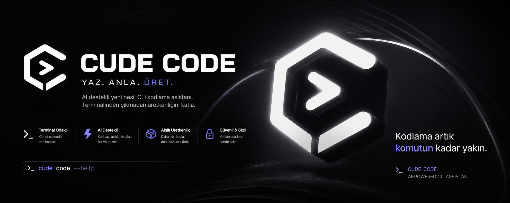

<p align="center">
  
</p>

# Cude Code - Professional AI Development CLI

> A provider-agnostic, safety-first AI coding agent for the terminal.

Current release: **v0.1.0** · [Changelog](CHANGELOG.md) · [Security policy](SECURITY.md)

## Cude Claw

Cude Claw is Cude Code's autonomous workflow mode: it plans a task, uses the
built-in tools, verifies its work, and reports a truthful completion or failure
status.

```bash
cude run "inspect the project, fix the failing tests, and summarize the changes"
```

For automation, use `--json --yes` to emit one machine-readable result:

```bash
cude run "run the tests and report failures" --yes --json
```

Create a read-only implementation plan before making changes:

```bash
cude plan "Add authentication to the API and cover it with tests"
```

Review local changes and inspect optional code-intelligence integrations:

```bash
cude review
cude doctor
cude doctor --json
```

Real language-server diagnostics and isolated parallel workers are available
when the corresponding tools are installed:

```bash
cude lsp diagnostics src/index.ts
cude task --task "Review the API" --task "Review the tests"
```

Each worker receives its own detached Git worktree under `.cude/worktrees/`;
changes are never merged automatically. This keeps parallel agent work
reviewable and prevents workers from silently overwriting one another.

Project memory is explicit and local. Save durable decisions or workflow notes
with `cude memory add`; entries are stored as JSONL in `.cude/memory.jsonl` and
included in the agent context on the next run. Use `cude memory list` to inspect
them or pass a search term to filter. Nothing is captured automatically:

```bash
cude memory add "Use npm test for verification" --tags testing,workflow
cude memory list testing

# Slogan-driven workflow
cude write "Add request validation to the API"
cude understand src/index.ts
cude produce "Implement the feature and leave it tested and reviewed"
```

The slogan is executable workflow, not decoration: `write` makes a focused
change, `understand` gives a read-only architecture/risk summary, and `produce`
implements the request, verifies it, then reviews the resulting diff.

`doctor` detects installed LSP servers, debuggers, and optional `omp`/`pi`
bridges. Cude Code does not silently claim LSP or DAP support when the required
server is absent.

Before an autonomous run, Cude Code automatically loads project instructions
from `AGENTS.md`, `CLAUDE.md`, or `.cude-context.md` in the current directory
and its parents. The closest `AGENTS.override.md` replaces the matching file.
Use `cude context` to audit the active files. Context is capped and truncated
safely so a large instruction file cannot consume the whole model window.
Project skills can be placed at `.cude/skills/<name>/SKILL.md` or
`.agents/skills/<name>/SKILL.md`.

Mutating file tools are confined to the workspace root, destructive commands
require confirmation, and failed or budget-exhausted runs exit with status 1.
See [docs/CUDE-CLAW.md](docs/CUDE-CLAW.md) for the workflow and extension guide.

[](https://opensource.org/licenses/MIT)
[](https://nodejs.org/)
[](https://www.typescriptlang.org/)
[](./CHANGELOG.md)

**The professional, multi-provider AI development CLI for your terminal**

Cude Code is a feature-rich CLI tool for AI-assisted development. It supports 19 AI providers, 22 agent tools, browser automation, native RAG, and brings professional capabilities to your terminal.

```bash
git clone https://github.com/Emrevrg/Cude-Code.git
cd Cude-Code && npm install && npm run build && npm link
cude chat
```

## Why Cude Code?

- **Free & Open Source**: MIT licensed, no hidden costs
- **19 AI Providers**: OpenAI, Anthropic, Gemini, DeepSeek, Groq, Ollama, and more
- **22 Agent Tools**: File ops, git, npm, diff, patch, search, browser, RAG
- **Browser Automation**: Navigate, screenshot, and extract web content via Playwright
- **Native RAG**: Index local codebases and search with keyword matching
- **Autonomous Agent**: Solve complex tasks with tool-use
- **Cost Tracking**: Monitor spending, set budgets, get alerts
- **Session Management**: Save and restore conversations
- **Project Context**: Compatible `AGENTS.md`/`CLAUDE.md` instructions with a `cude context` audit command
- **Privacy First**: Everything stays on your machine
- **Pure CLI**: No Electron, lightweight and fast

## Quick Start

### 1. Install

Not on npm yet. Install from source — this builds the CLI and puts `cude` on
your PATH:

```bash
git clone https://github.com/Emrevrg/Cude-Code.git
cd Cude-Code
npm install
npm run build
npm link
```

Optional — only needed for the three browser tools:
```bash
npx playwright install chromium
```

### 2. Setup
```bash
cude setup
```

### 3. Start Coding
```bash
# Free chat with no API costs
cude chat --free

# Chat with GPT-4
cude chat -p openai -m gpt-4

# Run an autonomous task
cude run "Create a REST API in TypeScript"
```

## Usage Examples

### Interactive Chat
```bash
# Start a conversation
cude chat

# Use specific provider and model
cude chat -p anthropic -m claude-opus-5

# Continue a previous session
cude chat -s my-project

# Use only free providers
cude chat --free
```

### Autonomous Tasks
```bash
# Code generation
cude run "Write a React component for data table"

# Code review
cude run "Review src/api and suggest improvements"

# Bug fixing
cude run "Fix the error in main.ts"

# Documentation
cude run "Generate API docs for src/"
```

### Configuration
```bash
# Interactive setup
cude setup

# Set API keys
cude config set-key openai sk-...
cude config set-key anthropic sk-ant-...

# List configured keys
cude config list-keys

# Set defaults
cude config set default-provider openai
cude config set default-model gpt-4o
```

### Provider Management
```bash
# List all providers
cude providers list

# Test connectivity
cude providers test

# View available models
cude providers models openai
```

### Budget Management
```bash
# Set spending limit
cude budget set 10          # $10 total
cude budget set 5 --monthly # $5/month

# Check spending
cude budget status

# Set alert
cude budget alert 5
```

### Session Management
```bash
# List sessions
cude sessions list

# Export session to markdown
cude sessions export <id> conversation.md

# Delete session
cude sessions delete <id>
```

Create an independent branch of a saved conversation with:

```bash
cude sessions fork <id> experiment
```

### Project Context
```bash
# Show the instruction files the agent will load
cude context
```

During a chat, use `/summary` for a compact audit of observable turns, model
calls, tools, approvals, errors, token usage, and cost. Use `/activity` for
the latest event list. The audit records what the application observed; it
does not expose private model chain-of-thought or API credentials.

## Upstream design influences

Cude Code keeps its TypeScript, provider-agnostic core while adopting useful
workflow ideas from [oh-my-pi](https://github.com/can1357/oh-my-pi) and
[Pi coding-agent](https://github.com/earendil-works/pi/tree/main/packages/coding-agent):
explicit project context, safe tool boundaries, resumable sessions, and an
extensible terminal-first workflow. Their native Rust/monorepo internals are
not copied into this repository, so Cude Code remains installable with Node.js
and keeps its existing provider and tool compatibility.

## Supported Providers

### Free & Fast
- **Groq**: Free tier, fastest responses
- **Gemini Flash**: Free tier, best quality for free
- **Ollama**: Local only, completely free

### Production Quality
- **OpenAI**: GPT-4 family, most capable
- **Anthropic**: Claude 5 family (Opus 5, Sonnet 5), best reasoning
- **Google Gemini**: Latest models, large context
- **DeepSeek**: Affordable, excellent for code

### Self-Hosted
- **Ollama**: Local models, no setup needed
- **vLLM**: High-performance serving
- **llama.cpp**: Minimal requirements

### Complete List
OpenAI, Anthropic, Google Gemini, Groq, DeepSeek, Mistral, xAI, Cohere, Together AI, Perplexity, NVIDIA, OpenRouter, Azure OpenAI, LiteLLM, HuggingFace, vLLM, Replicate, Local GGUF, Ollama

## Available Tools

Cude Code's agent can use **22 built-in tools**:

### File Operations
`read_file`, `write_file`, `replace_in_file` (multi-occurrence via `replace_all`), `delete_file`, `copy_file`, `move_file` (rename), `get_file_info`

### Directory Management
`create_directory`, `list_directory`

### Search
`search_files` (pattern), `grep_search` (content)

### Shell & Build
`run_command`, `npm_command`, `git_command`

### Patch & Diff
`apply_patch` (multi-hunk unified diff), `diff_files` (file comparison)

### Browser Automation
`browser_navigate` (fetch page content), `browser_screenshot` (capture pages), `browser_extract` (CSS selector extraction)

### Native RAG
`rag_index` (index local files), `rag_search` (keyword search across indexed files), `rag_summary` (index overview)

Destructive commands (e.g. `rm -rf`, `mkfs.`, `shutdown`) trigger an interactive confirmation before execution.

## Cost Tracking

Built-in budget management:

```bash
# Set $10 spending limit
cude budget set 10

# Get real-time spending report
cude budget status

# Set $5 per-month limit
cude budget set 5 --monthly

# Get alerts at $8
cude budget alert 8
```

Supported cost tracking for:
- OpenAI, Anthropic, Google, Groq, and all cloud providers
- Per-token pricing for accuracy
- Historical tracking and reports

## Documentation

- **[Changelog](./CHANGELOG.md)** - Release notes
- **[Contributing](./CONTRIBUTING.md)** - Development setup and project layout
- **[Security](./SECURITY.md)** - Reporting vulnerabilities, and what the agent can reach

## Configuration

### Environment Variables
```bash
export CUDE_OPENAI_KEY="sk-..."
export CUDE_ANTHROPIC_KEY="sk-ant-..."
```

Keys are looked up in this order, per provider:

1. `CUDE_<PROVIDER>_KEY`
2. `CUDE_<PROVIDER>_API_KEY`
3. the provider's conventional name — `OPENAI_API_KEY`, `ANTHROPIC_API_KEY`,
   `GEMINI_API_KEY`, `GROQ_API_KEY`, `REPLICATE_API_TOKEN` and so on, so keys
   already in your shell are picked up without renaming them
4. `~/.cude/config.json`, written by `cude config set-key`

Environment variables are read at startup and take precedence over the stored
config, which is handy for CI runs and ephemeral shells.

Defaults are not environment variables — set them with:

```bash
cude config set default-provider openai
cude config set default-model gpt-4o
```

### Config Files
- **Linux/macOS**: `~/.cude/config.json`
- **Windows**: `%USERPROFILE%\.cude\config.json`

Sessions are stored under `~/.cude/sessions/` and spending records under `~/.cude/budget.json`.

## Security

- All data stored locally
- No cloud sync (unless enabled)
- API keys never logged
- Destructive commands require confirmation
- Safe command execution
- Open source for transparency

## Benchmarks

Measured on Node 22, Linux x64, from a release build. Reproduce with the
commands in the right-hand column.

| Metric | Value | How it was measured |
|--------|-------|---------------------|
| Cold start | ~0.31 s | `time node dist/index.js --version` |
| Peak memory, cold start | ~84 MB | `VmHWM` of the CLI process |
| Providers | 19 | `cude providers list` |
| Agent tools | 22 | `TOOL_DEFINITIONS.length` |
| Task types routed | 9 | `src/core/selector.ts` |

## Contributing

We welcome contributions! Areas we need help with:

- [ ] Additional providers
- [ ] WebUI frontend
- [ ] VS Code extension
- [ ] Documentation improvements
- [ ] Bug fixes and optimizations

## License

MIT &copy; 2025 Cude Code Contributors

Free for personal and commercial use.

## Support

- **Issues**: [GitHub Issues](https://github.com/Emrevrg/Cude-Code/issues)
- **Discussions**: [GitHub Discussions](https://github.com/Emrevrg/Cude-Code/discussions)
- **Email**: zgremre@gmail.com
- **In-app help**: run `cude --help` or `cude <command> --help`

## Roadmap

### Current (v0.1)
- 19 AI providers
- Chat & autonomous agent modes
- 22 agent tools (file ops, git, npm, diff, patch, search, browser, RAG)
- Browser automation via Playwright
- Native RAG with local file indexing
- Session management
- Cost tracking with budgets & alerts
- Environment-variable key fallback
- Automatic legacy data migration

### Planned (v0.2)
- MCP (Model Context Protocol) server support
- VS Code extension
- Advanced analytics & spend reports

### Future (v1.0)
- Web UI dashboard
- Plugin system
- Team collaboration features

---

**Made with care by developers, for developers**

*Cude Code - Where AI meets your terminal*

[](https://github.com/Emrevrg/Cude-Code)
